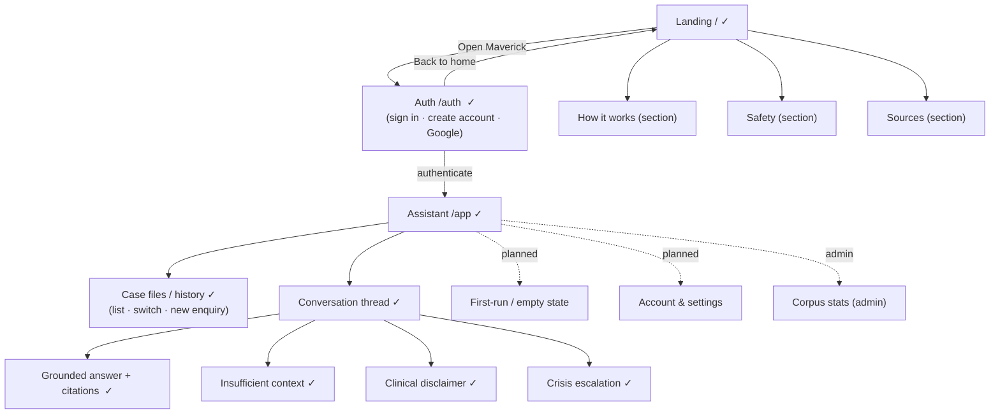

# Sitemap — Psychology Maverick

The information architecture of the prototype, and how it maps to the PRD screens
([docs/PRD.md](../PRD.md) §6.8). Built surfaces are marked ✓; the rest are planned for the
Next.js build.

## Route table

| Route | Surface | Mode | Auth | Status |
|-------|---------|------|------|--------|
| `/` | Landing | Persuade | public | ✓ built ([landing.html](../../design/prototype/landing.html)) |
| `/auth` | Sign in / Create account | Operate | public | ✓ built ([auth.html](../../design/prototype/auth.html)) |
| `/app` | Assistant (chat + history) | Operate | required | ✓ built ([assistant.html](../../design/prototype/assistant.html)) |
| `/app` (first run) | Empty state / onboarding | Operate | required | planned |
| `/account` | Account & settings | Operate | required | planned |
| `/admin/corpus` | Corpus stats | Operate | admin | planned |

## In-app states (one surface, several conditions)

The assistant is a single surface that renders four answer conditions, all built and demoed:
grounded-and-cited, insufficient-context, clinical-disclaimer, and crisis-escalation. Crisis takes
priority over retrieval (see [ADR-0004](../adr/0004-informational-safety-posture.md)).

## Notes

- The public site is single-page with in-page sections (How it works / Safety / Sources), not
  separate routes.
- `/auth` is one route with a sign-in / create-account toggle rather than two pages, to keep the
  entry frictionless.
- The prototype uses `.html` files; these routes are the target once the Next.js `frontend/` is
  scaffolded.
