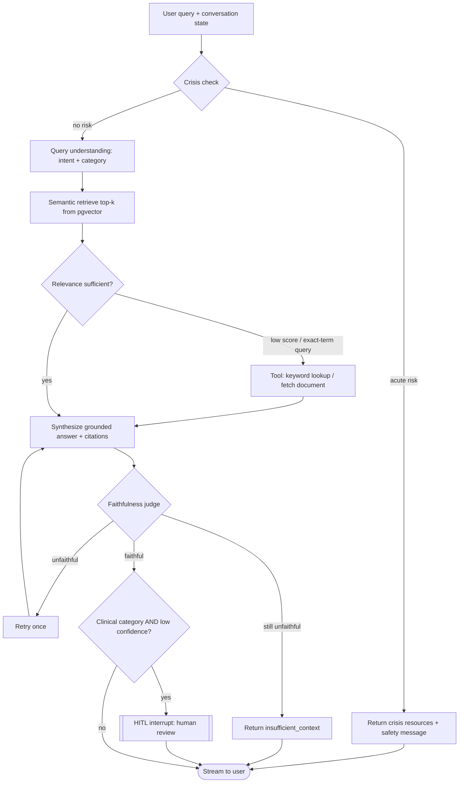

# Psychology Maverick

A retrieval-grounded AI assistant that answers questions about **psychology, psychiatry, and
mental health** from a curated, openly-licensed corpus — and cites every claim back to its
source. Built as a portfolio-grade demonstration of a **production AI application stack**,
where the LLM is only a small part of the overall architecture.

- **Dual purpose:** a *learning* companion (query anything across psychology & psychiatry and
  get grounded, cited explanations) **and** a *clarity* tool for people trying to understand
  mental health.
- **Informational, never advisory.** It explains what authoritative sources *say*; it does not
  diagnose, prescribe, or give personalized treatment advice. Safe by construction, not by a
  footnote. See [Safety Design](#8-safety-design).

> Canonical vocabulary lives in [CONTEXT.md](CONTEXT.md). Architectural decisions with lasting
> consequences are recorded in [docs/adr/](docs/adr/).

---

## 1. Settled Decisions (design log)

The whole project was scoped through a structured design interview. The outcomes:

| Area | Decision |
|------|----------|
| Purpose | Portfolio showcase, built *as if* production. Solo, MVP-first, vertical-slice early. |
| Domain | Knowledge assistant over psychology / psychiatry / mental-health corpus. |
| Corpus | OpenStax *Psychology 2e* + PLOS ONE research (psychology **and** psychiatry) + NIMH mental-health brochures. All openly licensed. |
| Agent | RAG **+ tool-calling** (keyword lookup, fetch-document), multi-turn, checkpointed. |
| Response | Structured Pydantic contract: `answer`, `citations[]`, `confidence`, `insufficient_context`, `category`. |
| Models | Config-driven multi-provider gateway via **LiteLLM** — any provider (Google, Anthropic, OpenAI, OpenRouter, DeepSeek, local), routed by role with fallback chains. |
| Embeddings | Config-driven, default local `bge-small-en-v1.5` (384-dim); Gemini embeddings a config switch. |
| Storage | **Postgres + pgvector** (relational *and* vectors in one DB) + **Redis** (cache, rate-limit, token revocation). |
| Safety | Informational-only posture; **crisis-first** routing; runtime **faithfulness judge**; targeted **human-in-the-loop** gate; clinical disclaimers. |
| Auth | Email/password + JWT (access + refresh w/ rotation), argon2 hashing, `user`/`admin` RBAC, strict per-user data ownership. |
| Observability | **Langfuse** tracing + LLM-as-judge evals (offline suite in CI + on-demand). |
| Frontend | **Next.js** (App Router) + TypeScript + Tailwind + shadcn/ui + Vercel AI SDK. Calm-editorial design. |
| Deployment | **Hybrid** — Vercel (frontend) → Render (FastAPI container) → Neon (Postgres) + Upstash (Redis) + Langfuse Cloud. |
| Tooling | `uv` (deps/envs), `ruff` (lint/format). |
| Architecture | **Modular monolith** with **feature-based vertical slices**; module boundaries enforced by `import-linter` in CI ([ADR-0005](docs/adr/0005-modular-monolith-vertical-slices.md)). |

---

## 2. Corpus

Three registers, ~30 documents (~98 MB), all openly licensed — reproduce with
[`data/fetch_corpus.sh`](data/fetch_corpus.sh). Full attribution in
[`data/corpus/SOURCES.md`](data/corpus/SOURCES.md).

| Register | Source | License | Role |
|----------|--------|---------|------|
| Textbook | OpenStax *Psychology 2e* | CC BY-NC-SA 4.0 | Foundational, broad ground truth |
| Research | PLOS ONE (psychology + psychiatry) | CC BY 4.0 | Current research; academic register |
| Consumer health | NIMH brochures | Public domain | Authoritative, plain-language; preferred for personal/clarity queries |

**Register preference:** personal / "help me understand what I'm feeling" queries lean on NIMH's
safety-reviewed plain language; academic / "what does research say" queries lean on
textbook + research. Every answer states which source it came from. `register` and `topic` are
chunk metadata.

Excluded on purpose: DSM-5 (copyright), and any paywalled source (APA PsycNet, ScienceDirect,
Sci-Hub).

---

## 3. Architecture Overview

```
┌────────────┐     HTTPS      ┌──────────────────────────────────────────────┐
│  Next.js   │  ───────────►  │  FastAPI (Render container)                   │
│ (Vercel)   │   SSE stream   │  ┌────────────┐  ┌───────────────────────┐   │
│ chat UI    │  ◄───────────  │  │ Auth + RL  │  │ LangGraph agent        │   │
└────────────┘                │  │ middleware │  │ crisis→retrieve→tools→ │   │
                              │  └────────────┘  │ synth→judge→(HITL)     │   │
                              │                  └───────────────────────┘   │
                              │        │ LiteLLM registry (any provider)     │
                              └────────┼──────────────┬──────────────┬───────┘
                                       │              │              │
                              ┌────────▼───┐   ┌──────▼─────┐  ┌─────▼──────┐
                              │ Neon       │   │ Upstash    │  │ Langfuse   │
                              │ Postgres + │   │ Redis      │  │ Cloud      │
                              │ pgvector   │   │ cache/RL   │  │ traces+eval│
                              └────────────┘   └────────────┘  └────────────┘
```

The seven core layers from the original stack study, mapped to concrete choices:

1. **Exposing the app — FastAPI + Uvicorn.** Fully async request path (async DB/Redis/httpx).
   Endpoints: `POST /chat` (SSE streaming), `GET /conversations/{id}`, auth routes, `GET /health`,
   a minimal admin/corpus-stats route. Ingestion is a **CLI**, not an endpoint.
2. **Validation & contracts — Pydantic.** Validates every request and the LLM's structured output
   (`Answer` contract). `insufficient_context` + `category` enum do real work.
3. **Orchestration & state — LangGraph.** Multi-node graph (below), Postgres checkpointer for
   resumable multi-turn threads, interrupt for the HITL gate.
4. **Storage & retrieval — Postgres + pgvector, Redis.** One DB for relational + vectors
   (HNSW index). Redis for response/embedding cache, rate-limiting, and refresh-token revocation.
5. **Model gateway — LiteLLM.** Config-driven registry; role-based routing (cheap grader/judge,
   premium synthesizer) + cross-provider fallback chains; OpenRouter as the catch-all.
6. **Observability & quality — Langfuse.** Traces every step; hosts the LLM-as-judge eval suite.
7. **Dev tooling — uv + ruff.**

Added layers beyond the original study: **auth & security**, **frontend/UX**, **deployment**,
and **runtime + offline guardrails/evals**.

---

## 4. Agent Flow (LangGraph)



- **Crisis check runs first** and can short-circuit the entire graph (safety over helpfulness).
- The **tool branch** is what makes LangGraph earn its place: the keyword/fetch tools are the
  escape hatch when semantic retrieval is weak (proper nouns, exact terms).
- The **faithfulness judge** is a cheap-model node that refuses to ship ungrounded claims.
- The **HITL interrupt** fires only for low-confidence clinical answers; it uses the checkpointer
  to pause and resume.

---

## 5. Data Model (Postgres + pgvector)

```sql
-- Identity & authz
users(id, email UNIQUE, password_hash, role[user|admin], created_at)
audit_log(id, user_id, event, ip, created_at)          -- auth events

-- Conversations (multi-turn)
conversations(id, user_id FK, title, created_at, updated_at)
messages(id, conversation_id FK, role[user|assistant], content, created_at)

-- Corpus (RAG)
documents(id, register, topic, title, source_path, license, metadata JSONB)
chunks(id, document_id FK, chunk_index, content,
       section_metadata JSONB,           -- chapter/section for citations
       embedding VECTOR(384))            -- HNSW index for ANN search

-- LangGraph checkpoints: managed by the Postgres checkpointer (its own tables)
```

- **One database** for relational data *and* vectors — see [ADR-0001](docs/adr/0001-single-postgres-pgvector.md).
- Embedding dimension (384) is fixed at index-build time; changing the embedding model requires
  re-ingesting the corpus.
- Redis holds: response cache, query-embedding cache, per-client rate-limit counters, and the
  refresh-token revocation set.

---

## 6. Model Gateway (LiteLLM)

Never hardcode a provider. A config file maps **logical roles → model strings**, each pluggable
by dropping an API key in `.env`:

```yaml
roles:
  grader:      { primary: gemini/gemini-1.5-flash, fallbacks: [openrouter/...] }
  synthesizer: { primary: gemini/gemini-1.5-pro,   fallbacks: [openrouter/anthropic/claude-...] }
  judge:       { primary: gemini/gemini-1.5-flash, fallbacks: [...] }
  embedder:    { primary: local/bge-small-en-v1.5, alt: gemini/text-embedding-004 }
```

Route cheap work (grading, judging) to a fast model, synthesis to a premium one, with
cross-provider fallback for resilience. Works with Google, Anthropic, OpenAI, DeepSeek,
OpenRouter (a gateway to hundreds more), and local models. See
[ADR-0002](docs/adr/0002-config-driven-model-gateway.md).

> **Available now:** a Google **Gemini API key**. (Claude *Pro* is a chat subscription and does
> **not** include API access — Anthropic API use requires separate pay-as-you-go credits.) The
> registry makes adding Claude/OpenAI/OpenRouter later a config change, not a code change.

---

## 7. Retrieval & Ingestion

- **Ingestion (offline CLI):** parse PDFs → **structure-aware chunking** (respect chapter/section
  and article structure, size-capped with small overlap) → attach `register`/`topic`/section
  metadata → embed → insert into Neon. Batched embedding.
- **Retrieval (request path):** semantic top-k = 5 over the HNSW index; the **keyword/fetch tools**
  are the explicit escape hatch when scores are low or the query is an exact-term lookup.
- **Documented upgrades:** reranking (cross-encoder), Redis **semantic cache**.

---

## 8. Safety Design

Safety is a first-class feature, not a disclaimer.

- **Informational-only posture.** Explains what sources say; never diagnoses or advises. See
  [ADR-0004](docs/adr/0004-informational-safety-posture.md).
- **Crisis escalation (highest priority).** A crisis-detection node runs **before retrieval**; on
  acute-risk signals it surfaces crisis resources (default US **988 Suicide & Crisis Lifeline** +
  international `findahelpline.com`, region-configurable) and a caring safety message, and stops.
  Detection errs toward showing resources.
- **Faithfulness judge (runtime guardrail).** Cheap-model node checks the answer is grounded before
  it ships; on failure → retry once → else `insufficient_context`. Toggleable for latency.
- **Human-in-the-loop.** Graph interrupts for **low-confidence clinical** answers (checkpointer
  pauses/resumes).
- **Clinical disclaimer** on all clinical-category answers ("informational, not a substitute for
  professional care").
- **Prompt-injection stance.** Hardened system prompt with instruction hierarchy; the curated
  corpus is a **trusted boundary** (indirect-injection risk documented, not over-engineered);
  tool arguments are Pydantic-validated.

---

## 9. Security

Locked controls: argon2 password hashing · JWT access + refresh with **rotation** + Redis
revocation · `user`/`admin` **RBAC** with strict per-user data ownership (defends OWASP-API-#1
IDOR) · parameterized SQL · CORS allow-list (Vercel origin) · security-headers middleware ·
`.env` + committed `.env.example` · request-size/query-length caps · login brute-force
protection · auth-event audit logging · **PII-aware tracing** (hash user IDs, redact before
Langfuse) · DB least-privilege role · CI scanning: `pip-audit`, `gitleaks`, `Trivy` on the image.

Deferred (README future-work): httpOnly-cookie refresh + CSRF (if the frontend moves to cookies),
WAF/Cloudflare, HSTS (TLS/deployment tier).

---

## 10. Performance

Locked: fully **async** request path · **HNSW** pgvector index · connection pooling (Neon pooled
+ SQLAlchemy pool) · embedding model **loaded once** at startup · **role-based cheap/premium**
model routing · **SSE streaming** · Redis response + embedding cache.

Deferred: Redis **semantic cache**, parallel graph nodes. Noted: Render free-tier cold starts
(cron-ping / paid tier fix).

---

## 11. Frontend (UX)

- **Stack:** Next.js App Router + TypeScript + Tailwind + shadcn/ui + Vercel AI SDK (streaming).
- **Design direction:** **calm editorial / trustworthy** — soft neutral palette, excellent reading
  typography, generous whitespace, restrained motion. Aesthetic matched to a mental-health
  audience (calm, credible, safe) rather than a loud signature. Calm-editorial references seeded
  from Refero, executed through a design skill so it is crafted, not templated.
- **Screens (MVP):**
  - **Chat** — streaming answers (the star).
  - **Conversation sidebar** — list / switch / rename / delete (multi-turn made visible).
  - **Auth** — login + signup, clean.
  - **Citation UX** *(the standout)* — inline citation chips that expand to the source passage +
    document/chapter, making "grounded, not hallucinated" visible.
  - **Trust/safety states** — distinct `insufficient_context` style, confidence indicator,
    clinical disclaimer banner, crisis-resource card.
  - Minimal read-only **corpus-stats** page (admin).

---

## 12. Observability & Evals

- **Tracing:** Langfuse captures every graph step (Cloud in prod; self-hosted in local compose).
- **Runtime guardrail:** the faithfulness judge (§8).
- **Offline eval suite:** LLM-as-judge scoring **faithfulness + retrieval relevance** on a
  hand-verified `evals/dataset.jsonl` (~25 questions, LLM-drafted then human-labeled). Same judge
  model + rubric as the runtime guardrail (one source of truth). Runs as `make eval` **and** in CI
  with a **quality gate** (e.g. fail the build if faithfulness < 0.8). Tool-selection eval added
  once the graph is stable. Predictable code is covered by PyTest.

---

## 13. Deployment (Hybrid)

Vercel (frontend) → Render (FastAPI **Docker** container) → Neon (Postgres+pgvector) +
Upstash (Redis) + Langfuse Cloud. See [ADR-0003](docs/adr/0003-hybrid-deployment.md).

- Local dev is `docker compose up` (app, Postgres+pgvector, Redis, Langfuse) — dev/prod parity.
- **Don't** use Render's free Postgres (deleted after 30 days) — data lives on Neon/Upstash.
- Render free web services cold-start after idle; mitigate with a cron ping or paid tier.

---

## 14. Repository Structure

```
AgenticAIApplication/
├─ backend/                   # modular monolith — see docs/adr/0005
│  ├─ app/
│  │  ├─ main.py              # app assembly: mounts feature routers, middleware, lifespan
│  │  ├─ core/                # PLATFORM layer (shared infra; no feature logic)
│  │  │  ├─ config.py  db.py  redis.py  security.py  observability.py
│  │  │  └─ llm/              # LiteLLM gateway: registry, routing, fallbacks
│  │  ├─ shared/              # contracts that genuinely span features (Answer, Citation)
│  │  └─ features/            # VERTICAL SLICES — each owns its full stack
│  │     ├─ auth/             # router · service · schemas · models · repository · deps · tests
│  │     ├─ conversations/    # multi-turn threads + messages
│  │     ├─ chat/             # POST /chat (SSE) — entry to the agent
│  │     ├─ assistant/        # LangGraph graph, nodes, state, checkpointer
│  │     ├─ retrieval/        # embeddings, pgvector search, keyword tool
│  │     ├─ corpus/           # documents, chunks, chunking, ingestion CLI
│  │     ├─ safety/           # crisis detection, faithfulness judge, disclaimers
│  │     └─ evals/            # dataset.jsonl, judge, runner
│  ├─ alembic/                # migrations
│  ├─ tests/                  # cross-feature / integration tests
│  ├─ importlinter.ini        # module-boundary contracts enforced in CI
│  ├─ Dockerfile
│  └─ pyproject.toml          # uv + ruff config
├─ frontend/                  # Next.js App Router + TS + Tailwind + shadcn/ui
├─ data/                      # corpus + fetch_corpus.sh  (already populated)
├─ docs/adr/                  # architecture decision records
├─ docker-compose.yml         # local: app, postgres+pgvector, redis, langfuse
├─ .github/workflows/         # CI: ruff, pytest, evals, pip-audit, gitleaks, trivy
├─ CONTEXT.md                 # domain glossary
└─ project.md                 # this file
```

---

## 15. Build Sequence (MVP-first)

1. **Vertical slice:** ingest a *subset* → one `/chat` path (retrieve → synthesize) → one Langfuse
   trace visible. Prove the spine end-to-end.
2. **Contracts & storage:** Pydantic `Answer`, Postgres schema + pgvector/HNSW, full ingestion CLI.
3. **Agent:** LangGraph nodes incl. tool branch + checkpointer + multi-turn.
4. **Safety:** crisis node, faithfulness judge, HITL interrupt, disclaimers.
5. **Model gateway:** LiteLLM registry + role routing + fallback.
6. **Auth & security** hardening.
7. **Evals** suite + CI quality gate.
8. **Frontend:** chat + citations + trust states + auth + sidebar.
9. **Deploy:** compose → Render + Neon + Upstash + Vercel + Langfuse Cloud.

---

## 16. Out of Scope / Future Work

Kubernetes/autoscaling/load-balancing; user accounts beyond email-password (OAuth is a documented
extension); reranking; Redis semantic cache; parallel graph nodes; cookie-based auth + CSRF; WAF.

---

## 17. Attribution & Ethics

Non-commercial portfolio/education project (the textbook is NC-licensed). Every answer cites its
source. The assistant is **informational, not clinical** — it surfaces crisis resources rather
than attempting to handle a crisis, and never diagnoses or gives personalized treatment advice.
